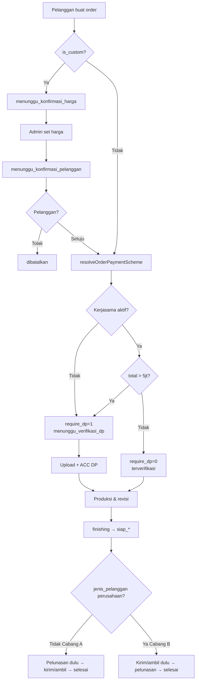

# Flow Bisnis SIMENAK — Dokumentasi Lengkap

> **SIMENAK** — Sistem Informasi Pemesanan Percetakan Z'Plack  
> Sumber kebenaran: implementasi runtime CodeIgniter 4 (`app/Controllers`, `app/Helpers`, `app/Commands`).  
> Terakhir disusun berdasarkan kode aktif proyek.

---

## Daftar Isi

1. [Ringkasan Sistem](#1-ringkasan-sistem)
2. [Tipe Pelanggan & Skema Pembayaran](#2-tipe-pelanggan--skema-pembayaran)
3. [Registrasi, Login & Kerja Sama Perusahaan](#3-registrasi-login--kerja-sama-perusahaan)
4. [Pembuatan Pesanan](#4-pembuatan-pesanan)
5. [Alur Custom Order](#5-alur-custom-order)
6. [Alur Pembayaran DP](#6-alur-pembayaran-dp)
7. [Alur Produksi & Revisi Desain](#7-alur-produksi--revisi-desain)
8. [Alur Pengiriman / Ambil Sendiri](#8-alur-pengiriman--ambil-sendiri)
9. [Alur Pelunasan](#9-alur-pelunasan)
10. [Pembatalan Pesanan](#10-pembatalan-pesanan)
11. [Peta Status Order (Lengkap)](#11-peta-status-order-lengkap)
12. [Notifikasi — Trigger Lengkap](#12-notifikasi--trigger-lengkap)
13. [Cron / Scheduler](#13-cron--scheduler)
14. [Diagram End-to-End](#14-diagram-end-to-end)
15. [Referensi File Kode](#15-referensi-file-kode)

---

## 1. Ringkasan Sistem

SIMENAK mengelola siklus hidup pesanan percetakan dari pembuatan order hingga selesai, dengan cabang berbeda berdasarkan:

| Faktor | Pengaruh |
|--------|----------|
| **Jenis pelanggan** (snapshot di baris `orders`) | Skema DP & timing pelunasan |
| **Custom vs standar** | Perlu konfirmasi harga admin dulu |
| **Metode pengiriman** (`kurir` / `ambil_sendiri`) | Alur resi vs konfirmasi diambil |
| **Total harga vs batas Rp 5.000.000** | Kerja sama perusahaan: DP wajib atau tidak |

### Peran pengguna

| Role | Fungsi utama |
|------|----------------|
| `pelanggan` | Pesan, upload DP/pelunasan, ACC/revisi desain, konfirmasi terima |
| `admin` | Set harga custom, set siap kirim/ambil, input resi, kelola kerjasama, batalkan order |
| `keuangan` | Verifikasi DP & pelunasan |
| `produksi` | Upload draft desain, update status cetak → finishing |
| `owner` | Dashboard/laporan; penerima eskalasi reminder (6 jam / SLA custom) |

### Status order (`orders.status`) — nilai ENUM

| Status | Dipakai runtime? |
|--------|------------------|
| `menunggu_konfirmasi_harga` | Ya (custom) |
| `menunggu_konfirmasi_pelanggan` | Ya (custom) |
| `menunggu_verifikasi_dp` | Ya |
| `terverifikasi` | Ya |
| `proses_desain` | Ya |
| `proses_revisi` | Ya |
| `proses_cetak` | Ya |
| `finishing` | Ya |
| `siap_kirim` | Ya |
| `siap_diambil` | Ya |
| `dikirim` | Ya |
| `pesanan_diterima` | **ENUM saja — tidak diset di controller** |
| `menunggu_verifikasi_lunas` | Ya |
| `pelunasan_terverifikasi` | Ya (cabang pelunasan sebelum kirim) |
| `selesai` | Ya |
| `dibatalkan` | Ya |

### Status terkait modul lain

| Tabel | Status | Nilai |
|-------|--------|-------|
| `payments` | `status` | `menunggu` \| `terverifikasi` \| `ditolak` |
| `revisi_desain` | `status` | `uploaded` \| `diajukan_revisi` \| `acc` \| `ditolak` |
| `pengiriman` | `status_kirim` | `dikirim` \| `diterima` \| `diambil` |

---

## 2. Tipe Pelanggan & Skema Pembayaran

Helper utama: `app/Helpers/notification_helper.php`.

### Terminologi

| Label UI | Nilai DB / kode | Catatan |
|----------|-----------------|---------|
| Perseorangan | `jenis = 'perseorangan'` | Default semua akun baru |
| Kerja Sama Perusahaan | `jenis = 'perusahaan'` + `is_verified = 1` | Hanya Admin yang menetapkan |
| “Mitra” | — | Di konteks bisnis Z'Plack = CV Mitra Mandiri Group, **bukan** label akun pelanggan |

### Predikat akun

```
pelangganIsKerjasamaPerusahaan(pelanggan)
  → TRUE jika jenis === 'perusahaan' AND is_verified === 1

resolveJenisPelangganFromAkun(pelanggan)
  → 'perusahaan' jika kerjasama aktif, selain itu 'perseorangan'

pelangganCanCreateOrder(pelanggan)
  → semua pelanggan terdaftar boleh pesan (ada baris pelanggan)
```

### Konstanta

| Konstanta | Nilai | Arti |
|-----------|-------|------|
| `BATAS_ORDER_TANPA_DP` | `5.000.000` | Kerja sama ≤ batas → tanpa DP |
| DP | 50% dari `total_harga` (`nominalDpFromTotal`) | Jika `require_dp = 1` |
| Pelunasan jika ada DP | 50% sisa | `nominalPelunasanFromOrder` |
| Pelunasan jika tanpa DP | 100% total | Kerja sama ≤ 5 jt |

### `resolveOrderPaymentScheme(pelanggan, jenisDiminta, totalHarga)`

> Parameter `jenisDiminta` dari form **diabaikan**. Skema selalu dari profil akun saat order dibuat (atau saat pelanggan setuju harga custom).

```
JIKA BUKAN kerjasama perusahaan aktif:
  jenisFinal     = perseorangan
  requireDp      = 1
  statusAwal     = menunggu_verifikasi_dp

JIKA kerjasama perusahaan aktif:
  jenisFinal = perusahaan
  JIKA totalHarga > 5.000.000:
    requireDp  = 1
    statusAwal = menunggu_verifikasi_dp
  ELSE:
    requireDp  = 0
    statusAwal = terverifikasi
```

### Timing pelunasan — `isPelunasanSebelumKirim(order)`

Didasarkan pada **snapshot** `orders.jenis_pelanggan`, bukan status akun live:

| Kondisi | Cabang | Pelunasan |
|---------|--------|-----------|
| `jenis_pelanggan !== 'perusahaan'` | **A** — sebelum kirim/ambil | Upload di `siap_kirim` / `siap_diambil` |
| `jenis_pelanggan === 'perusahaan'` | **B** — setelah terima/ambil | Upload di `menunggu_verifikasi_lunas` (setelah barang diterima/diambil) |

> Order kerja sama **> 5 jt** tetap wajib DP di awal, tetapi pelunasan sisa tetap **Cabang B**.

### Gate helper terkait pembayaran

| Fungsi | Kondisi |
|--------|---------|
| `canUploadPelunasan` | Cabang A: status ∈ `{siap_kirim, siap_diambil}`; Cabang B: status = `menunggu_verifikasi_lunas` |
| `accPelunasanTargetStatus` | Cabang A → `pelunasan_terverifikasi`; Cabang B → `selesai` |
| `revertStatusAfterPelunasanDitolak` | Cabang A → kembali `siap_*`; Cabang B → tetap `menunggu_verifikasi_lunas` |
| `canViewNotaTagihan` | `total_harga > 0` dan status ∈ `{siap_kirim, siap_diambil, menunggu_verifikasi_lunas, pelunasan_terverifikasi}` |
| `statusSiapSebelumPelunasan` | `ambil_sendiri` → `siap_diambil`, selain itu `siap_kirim` |

### Snapshot order vs perubahan akun

- Saat Admin **cabut kerjasama**, pesanan **lama** tidak diubah (`jenis_pelanggan` / `require_dp` tetap).
- Hanya pesanan **baru** yang mengikuti skema perseorangan.

---

## 3. Registrasi, Login & Kerja Sama Perusahaan

### 3.1 Registrasi

**Controller:** `AuthController` (`attemptRegister` / `registerAjax`)

**Field wajib:** nama, email (unik), no_telp, alamat, password (≥ 8) + konfirmasi.

**Hasil:**
1. Insert `users` dengan `role = pelanggan`
2. Insert `pelanggan` dengan `jenis = perseorangan`, `is_verified = 0`
3. **Tidak ada** pilihan jenis akun / upload dokumen perusahaan saat register
4. Tidak auto-login — user diminta login

UI: modal di landing page (`layouts/landing.php`).

### 3.2 Login

| Entry point | Perilaku |
|-------------|----------|
| Portal `/login` (`loginProcess`) | Role internal OK; jika pelanggan → session dihancurkan, paksa login via landing |
| Landing AJAX (`loginAjax`) | Pelanggan OK; role internal → 403 (pakai Portal Login) |
| Google OAuth | Hanya akun pelanggan yang sudah terdaftar; link/update `google_id` |

**Session:** `isLoggedIn`, `id_user`, `nama`, `role`; jika pelanggan juga `id_pelanggan`.

**Redirect dashboard:**

| Role | Path |
|------|------|
| pelanggan | `/dashboard` |
| admin | `/admin/dashboard` |
| keuangan | `/keuangan/dashboard` |
| produksi | `/produksi/dashboard` |
| owner | `/owner/dashboard` |

### 3.3 Tetapkan Kerja Sama Perusahaan

**Route:** `POST /pengguna/{id}/tetapkan-kerjasama`  
**Method:** `ProfilController::tetapkanKerjasamaPerusahaan`  
**Aktor:** Admin

**Prasyarat:** akun belum kerjasama aktif.

**Field wajib:** `nama_perusahaan`, `jabatan_pic`, `wa_perusahaan`, `alamat_kantor`  
**Opsional:** `no_npwp` (15 digit), `catatan_admin`, dokumen NPWP / KTP PIC / MoU (PDF) → `uploads/dokumen_verifikasi/`

**DB:**
1. Insert arsip `verifikasi_perusahaan` status `verified`
2. Update pelanggan: `jenis = perusahaan`, `is_verified = 1`, `is_suspended = 0`

**Notif:** email + WA + in-app ke pelanggan (tanpa `id_order`).

### 3.4 Cabut Kerja Sama

**Route:** `POST /pengguna/{id}/cabut-kerjasama`  
**Method:** `ProfilController::cabutKerjasamaPerusahaan`

**DB:**
1. Arsip `verifikasi_perusahaan` status `rejected`
2. Pelanggan → `jenis = perseorangan`, `is_verified = 0`

**Notif:** email + WA + in-app ke pelanggan — pesanan baru memakai skema perseorangan.

> Owner **tidak** memverifikasi perusahaan (menu legacy dihapus).

---

## 4. Pembuatan Pesanan

**Controller:** `OrderController::store`  
**Aktor:** Pelanggan (harus punya baris `pelanggan`)

### Validasi form

| Field | Aturan |
|-------|--------|
| `id_katalog` | Wajib |
| `jumlah_order` | > 0; **≥ `katalog.min_order`** |
| `deadline_diajukan` | Wajib |
| `metode_pengiriman` | `kurir` atau `ambil_sendiri` |
| `alamat_kirim` | Min 10 karakter jika kurir |
| `catatan_custom` | Min 10 jika custom |
| File referensi | Wajib jika custom (jpg/jpeg/png/pdf, max 2MB) |

### Minimum order

```
JIKA jumlah_order < katalog.min_order:
  error "Minimum order {min_order} {satuan}."
  redirect kembali ke form
```

### Penentuan harga & status awal

1. `jenisDiminta` = `resolveJenisPelangganFromAkun(pelanggan)` (POST `jenis_pelanggan` tidak dipakai untuk DB)
2. `totalHarga` = `0` jika custom, else `harga_dasar × jumlah_order`
3. `scheme` = `resolveOrderPaymentScheme(...)`
4. **Override custom:** paksa `statusAwal = menunggu_konfirmasi_harga`, `require_dp = 1` (status scheme diabaikan sampai pelanggan setuju harga)

### Data yang disimpan di `orders`

| Kolom | Nilai |
|-------|-------|
| `jenis_pelanggan` | `scheme.jenisFinal` |
| `require_dp` | dari scheme (custom: 1) |
| `status` | dari scheme / override custom |
| `kuota_revisi` / `sisa_kuota` | = `katalog.kuota_revisi_default` (beku selamanya) |
| `deadline_produksi` | `null` jika custom; else = `deadline_diajukan` |
| `batas_upload_dp` | `now + 24 jam` hanya jika `require_dp=1` **dan** `is_custom=0`; selain itu `null` |
| EAV | `order_attributes` (field dari `form_templates`); file → `uploads/lampiran_peta/` |
| Referensi custom | `uploads/referensi/` |

### Side effect setelah create

| Kondisi | Notifikasi |
|---------|------------|
| Custom | Email+WA pelanggan; in-app+email+WA semua admin |
| Standar + `require_dp = 0` | Email+WA pelanggan (“langsung antrian produksi”) |
| Standar + `require_dp = 1` | **Tidak ada** notif saat create |

Redirect selalu ke `order/detail/{kode}`.

---

## 5. Alur Custom Order

**Controller:** `CustomOrderController`

```
[Pelanggan buat custom]
        ↓
menunggu_konfirmasi_harga   (total_harga=0, batas_upload_dp=null)
        ↓
[Admin setHarga]  — harga > 0, deadline ≥ hari ini
        ↓
menunggu_konfirmasi_pelanggan
        ↓
   ┌────┴────┐
setuju     tolak
   ↓         ↓
(scheme)  dibatalkan (+ notif admin)
```

### 5.1 Admin set harga (`setHarga`)

**Update:** `harga_custom`, `total_harga`, `estimasi_hari`, `estimasi_custom`, `catatan_admin_custom`, `deadline_produksi`, status → `menunggu_konfirmasi_pelanggan`  
**Notif:** email + WA + in-app ke pelanggan  
**Redirect:** `list-pemesanan?tab=custom`

### 5.2 Pelanggan setuju (`setuju`)

1. Hitung ulang scheme dari **akun saat ini** + `total_harga`
2. Update `status`, `require_dp`
3. Jika DP: set `batas_upload_dp = now+24h`, `reminder_dp_sent = 0`
4. **Tidak mengirim notifikasi**
5. Redirect detail + pesan (arahkan ke upload DP atau antrian)

### 5.3 Pelanggan tolak (`tolak`)

- Status → `dibatalkan`
- Notif: in-app + email + WA ke **semua admin**

### 5.4 Eskalasi cron (SLA harga)

Command: `php spark reminder-konfirmasi-harga-custom`

| Kondisi | Aksi |
|---------|------|
| `is_custom=1`, status `menunggu_konfirmasi_harga`, `reminder_harga_eskalasi_sent=0` | — |
| `created_at` lebih dari **2 hari kerja** | Notif email+in-app+WA ke **owner**; set flag = 1 |

---

## 6. Alur Pembayaran DP

**Controller:** `PaymentController`  
**Aktif jika:** `require_dp = 1` dan status `menunggu_verifikasi_dp`

### 6.1 Upload DP (`uploadDp`) — Pelanggan

**Prasyarat:**
- Status order = `menunggu_verifikasi_dp`
- `require_dp = 1`
- Belum ada payment DP status `menunggu` / `terverifikasi`
- Jika sebelumnya `ditolak` → boleh re-upload (update baris yang sama)

**Aksi:**
- Simpan bukti → `uploads/bukti_bayar/`
- Insert/update `payments`: `jenis=dp`, `status=menunggu`, nominal 50%
- **Status order tidak berubah**
- Notif: email + in-app + WA ke semua **keuangan**
- Flag reminder verifikasi di-reset (agar cron 2j/6j bisa jalan lagi)

### 6.2 ACC DP (`accDp`) — Keuangan

- Payment → `terverifikasi`
- Order → `terverifikasi`
- Notif: email + WA + in-app ke pelanggan

### 6.3 Tolak DP (`tolakDp`) — Keuangan

- Payment → `ditolak` + catatan
- Order **tetap** `menunggu_verifikasi_dp`
- Reset `batas_upload_dp = now+24h`, `reminder_dp_sent = 0`
- Notif: email + WA + in-app ke pelanggan

### 6.4 Deadline DP (cron `cek-dp-deadline`)

| Tahap | Kondisi | Aksi |
|-------|---------|------|
| Reminder ~12 jam | `batas_upload_dp ≤ now+12h`, belum ada DP aktif, `reminder_dp_sent=0` | Email+WA ke pelanggan; set `reminder_dp_sent=1` |
| Auto batal 24 jam | `batas_upload_dp ≤ now`, belum ada DP `menunggu`/`terverifikasi` | Order → `dibatalkan`; email+WA+in-app ke pelanggan |

---

## 7. Alur Produksi & Revisi Desain

**Controller:** `RevisiController`

### 7.1 Kuota revisi

- Saat create: `kuota_revisi = sisa_kuota = katalog.kuota_revisi_default`
- Nilai `kuota_revisi` **tidak pernah bertambah**
- Setiap **ajukan revisi** → `sisa_kuota -= 1`
- Jika `sisa_kuota = 0`: tombol Tolak/ajukan disabled; hanya ACC yang diizinkan

### 7.2 Upload draft — Produksi (`upload`)

**Prasyarat order status:** ∈ `{terverifikasi, proses_desain, proses_revisi}`  
**Gate `canProduksiUploadDraft`:** belum ada revisi **ATAU** revisi terakhir status = `diajukan_revisi`

**Aksi:**
- File jpg/jpeg/png max **1MB** → `uploads/draft_desain/`
- Insert `revisi_desain` status `uploaded`, versi auto-increment
- Order → `proses_desain`
- Notif: in-app + email + WA ke pelanggan

### 7.3 Ajukan revisi — Pelanggan (`ajukan`)

**Prasyarat:**
- `sisa_kuota > 0` (jika 0 → error “Kuota revisi habis. Hanya bisa ACC.”)
- Revisi status = `uploaded`

**Aksi:**
- Revisi → `diajukan_revisi` + catatan
- Order → `proses_revisi`, `sisa_kuota -= 1`
- Notif: **in-app saja** ke semua produksi

### 7.4 ACC desain — Pelanggan (`acc`)

| Kondisi kuota | Aturan ACC |
|---------------|------------|
| `sisa_kuota > 0` | Hanya boleh ACC revisi terbaru berstatus `uploaded` |
| `sisa_kuota ≤ 0` | Boleh ACC `uploaded` **atau** `diajukan_revisi`; tidak boleh sudah ada ACC sebelumnya |

**Aksi:**
- Revisi → `acc`
- Order → `proses_cetak`
- Notif: **in-app saja** ke semua produksi

### 7.5 Cetak → finishing — Produksi (`updateStatusProduksi`)

- Hanya transisi: `proses_cetak` → `finishing`
- Notif: email + WA ke pelanggan (**tanpa** in-app)

---

## 8. Alur Pengiriman / Ambil Sendiri

**Controller:** `PengirimanController`

### 8.1 Set siap (`proses` aksi=`set_siap`) — Admin

**Prasyarat:** status = `finishing`

```
JIKA metode_pengiriman = ambil_sendiri → siap_diambil
ELSE                                  → siap_kirim
```

Notif: email + WA + in-app ke pelanggan.

### 8.2 Cabang A — Perseorangan (pelunasan **sebelum** kirim)

```
siap_kirim / siap_diambil
        ↓
[Pelanggan upload pelunasan] → menunggu_verifikasi_lunas
        ↓
[Keuangan ACC] → pelunasan_terverifikasi
        ↓
   ┌────┴────────────────┐
 kurir                 ambil_sendiri
   ↓                       ↓
[Admin set_dikirim]   [Admin konfirmasi_diambil]
   ↓                       ↓
 dikirim                 selesai
   ↓
[Pelanggan konfirmasi diterima]
   ↓
 selesai
```

**Gate `set_dikirim` (Cabang A):** status harus `pelunasan_terverifikasi`, `no_resi` wajib.  
**Gate `konfirmasi_diambil` (Cabang A):** dari `pelunasan_terverifikasi` → `selesai`.

### 8.3 Cabang B — Kerja sama perusahaan (pelunasan **setelah** terima)

```
siap_kirim
        ↓
[Admin set_dikirim + resi] → dikirim
        ↓
[Pelanggan konfirmasi diterima] → menunggu_verifikasi_lunas
        ↓
[Upload + ACC pelunasan] → selesai

siap_diambil
        ↓
[Admin konfirmasi_diambil] → menunggu_verifikasi_lunas
        ↓
[Upload + ACC pelunasan] → selesai
```

**Gate `set_dikirim` (Cabang B):** status harus `siap_kirim`.

### 8.4 Konfirmasi diterima — Pelanggan (`konfirmasiDiterimaPelanggan`)

**Prasyarat:** status = `dikirim`, metode ≠ ambil_sendiri, pemilik order.

| Cabang | Hasil status | Notif |
|--------|--------------|-------|
| A (sebelum kirim) | `selesai` | email+WA+in-app “Pesanan Selesai” |
| B (setelah terima) | `menunggu_verifikasi_lunas` | email+WA+in-app “Nota Tagihan Pelunasan” |

Pengiriman: `status_kirim = diterima`.

### 8.5 Daftar order di halaman pengiriman (Admin)

Status ∈ `{finishing, siap_kirim, siap_diambil, dikirim, pelunasan_terverifikasi}`  
**ATAU** (`menunggu_verifikasi_lunas` **DAN** `jenis_pelanggan = perseorangan`).

---

## 9. Alur Pelunasan

**Controller:** `PaymentController`

### 9.1 Upload pelunasan (`uploadPelunasan`) — Pelanggan

**Prasyarat:** `canUploadPelunasan(order)` true (lihat §2).

**Aksi:**
- Bukti → `uploads/bukti_bayar/`
- Payment `jenis=pelunasan`, `status=menunggu`, nominal via `nominalPelunasanFromOrder`
- Order **selalu** di-set ke `menunggu_verifikasi_lunas`
- Notif: email + in-app + WA ke keuangan

### 9.2 ACC pelunasan (`accPelunasan`) — Keuangan

| Cabang | Target status | Notif tambahan |
|--------|---------------|----------------|
| A | `pelunasan_terverifikasi` | Pelanggan (email+WA+in-app); **in-app** ke semua admin (“Siap Diproses Pengiriman”) |
| B | `selesai` | Pelanggan (email+WA+in-app) |

### 9.3 Tolak pelunasan (`tolakPelunasan`) — Keuangan

- Payment → `ditolak`
- Status order via `revertStatusAfterPelunasanDitolak`
- Notif: email + WA + in-app ke pelanggan

### 9.4 Reminder verifikasi pelunasan (cron)

Sama pola dengan DP:

| Waktu sejak `tgl_upload` | Penerima | Flag |
|--------------------------|----------|------|
| ≥ 2 jam | Semua keuangan | `reminder_verif_2j_sent` |
| ≥ 6 jam | Semua owner | `reminder_verif_6j_sent` |

---

## 10. Pembatalan Pesanan

**Method:** `OrderController::batalkan` (atau setara)

| Aktor | Status yang diizinkan |
|-------|------------------------|
| **Pelanggan** | `menunggu_verifikasi_dp`, `menunggu_konfirmasi_harga`, `menunggu_konfirmasi_pelanggan`, `terverifikasi`, `proses_desain`, `proses_revisi` |
| **Admin** | **Semua status** (tanpa whitelist) |

**Hasil:** `status = dibatalkan`

| Aktor batal | Notifikasi |
|-------------|------------|
| Admin | Email + WA ke pelanggan (**tanpa** in-app) |
| Pelanggan (self) | **Tidak ada** notif |

Redirect: pelanggan → detail order; admin → `list-pemesanan`.

**Auto-batal:** cron DP deadline (§6.4).

---

## 11. Peta Status Order (Lengkap)

### Rantai produksi bersama

```
menunggu_konfirmasi_harga → menunggu_konfirmasi_pelanggan
        → (scheme) menunggu_verifikasi_dp | terverifikasi
        → proses_desain ⇄ proses_revisi
        → proses_cetak → finishing
        → siap_kirim | siap_diambil
```

### Cabang A — Perseorangan

```
siap_* → menunggu_verifikasi_lunas → pelunasan_terverifikasi
      → (kurir) dikirim → selesai
      → (ambil) selesai
```

### Cabang B — Kerja sama perusahaan

```
siap_kirim → dikirim → menunggu_verifikasi_lunas → selesai
siap_diambil → menunggu_verifikasi_lunas → selesai
```

### Transisi detail (tabel)

| Dari | Ke | Pemicu | Kondisi utama |
|------|-----|--------|---------------|
| *(create standar)* | `menunggu_verifikasi_dp` / `terverifikasi` | `OrderController::store` | Scheme pembayaran |
| *(create custom)* | `menunggu_konfirmasi_harga` | `store` | `is_custom=1` |
| `menunggu_konfirmasi_harga` | `menunggu_konfirmasi_pelanggan` | Admin `setHarga` | Harga > 0 |
| `menunggu_konfirmasi_pelanggan` | scheme status | Pelanggan `setuju` | Re-resolve scheme |
| `menunggu_konfirmasi_pelanggan` | `dibatalkan` | Pelanggan `tolak` | — |
| `menunggu_verifikasi_dp` | *(tetap)* | `uploadDp` | Insert payment menunggu |
| `menunggu_verifikasi_dp` | `terverifikasi` | `accDp` | — |
| `menunggu_verifikasi_dp` | `dibatalkan` | Cron / batal manual | Deadline / whitelist |
| `terverifikasi` / `proses_revisi` | `proses_desain` | Produksi upload draft | Gate upload |
| `proses_desain` | `proses_revisi` | Pelanggan ajukan | `sisa_kuota > 0` |
| *(ACC)* | `proses_cetak` | Pelanggan ACC | Aturan kuota |
| `proses_cetak` | `finishing` | Produksi update | Hanya finishing |
| `finishing` | `siap_kirim` / `siap_diambil` | Admin set_siap | Metode kirim |
| `siap_*` | `menunggu_verifikasi_lunas` | Upload pelunasan (A) | Cabang A |
| `menunggu_verifikasi_lunas` | `pelunasan_terverifikasi` | ACC pelunasan (A) | Cabang A |
| `pelunasan_terverifikasi` | `dikirim` | set_dikirim | Cabang A + kurir |
| `pelunasan_terverifikasi` | `selesai` | konfirmasi diambil | Cabang A + ambil |
| `dikirim` | `selesai` | Konfirmasi diterima | Cabang A |
| `siap_kirim` | `dikirim` | set_dikirim | Cabang B |
| `dikirim` / `siap_diambil` | `menunggu_verifikasi_lunas` | Terima / diambil | Cabang B |
| `menunggu_verifikasi_lunas` | `selesai` | ACC pelunasan (B) | Cabang B |

---

## 12. Notifikasi — Trigger Lengkap

### Saluran

| Channel | Helper | Keterangan |
|---------|--------|------------|
| In-app | `sendNotifInApp` | Insert tabel `notifications` |
| Email | `sendNotifEmail` | CI4 Email + Gmail SMTP |
| WhatsApp | `sendNotifWa` / `sendNotifWaForRole` | Fonnte API (`fonnte.token` di `.env`) |

Nomor WA staf digabung dari `pelanggan.no_telp` user ber-role tersebut + daftar env `fonnte.notify.{role}`.

---

### 12.1 Trigger langsung (aksi user)

| # | Event | Penerima | Email | WA | In-app | Lokasi |
|---|-------|----------|:-----:|:--:|:------:|--------|
| 1 | Custom order dibuat | Pelanggan | ✓ | ✓ | — | `OrderController::store` |
| 2 | Custom order dibuat | Semua admin | ✓ | ✓ | ✓ | `OrderController::store` |
| 3 | Order standar tanpa DP | Pelanggan | ✓ | ✓ | — | `OrderController::store` |
| 4 | Admin batalkan order | Pelanggan | ✓ | ✓ | — | `OrderController::batalkan` |
| 5 | Admin set harga custom | Pelanggan | ✓ | ✓ | ✓ | `CustomOrderController::setHarga` |
| 6 | Pelanggan tolak harga custom | Semua admin | ✓ | ✓ | ✓ | `CustomOrderController::tolak` |
| 7 | Upload bukti DP | Semua keuangan | ✓ | ✓ | ✓ | `PaymentController::uploadDp` |
| 8 | ACC DP | Pelanggan | ✓ | ✓ | ✓ | `PaymentController::accDp` |
| 9 | Tolak DP | Pelanggan | ✓ | ✓ | ✓ | `PaymentController::tolakDp` |
| 10 | Upload bukti pelunasan | Semua keuangan | ✓ | ✓ | ✓ | `PaymentController::uploadPelunasan` |
| 11 | ACC pelunasan → `selesai` (B) | Pelanggan | ✓ | ✓ | ✓ | `PaymentController::accPelunasan` |
| 12 | ACC pelunasan → `pelunasan_terverifikasi` (A) | Pelanggan | ✓ | ✓ | ✓ | `PaymentController::accPelunasan` |
| 13 | ACC pelunasan (A) | Semua admin | — | — | ✓ | `PaymentController::accPelunasan` |
| 14 | Tolak pelunasan | Pelanggan | ✓ | ✓ | ✓ | `PaymentController::tolakPelunasan` |
| 15 | Upload draft desain | Pelanggan | ✓ | ✓ | ✓ | `RevisiController::upload` |
| 16 | Status → finishing | Pelanggan | ✓ | ✓ | — | `RevisiController::updateStatusProduksi` |
| 17 | ACC desain | Semua produksi | — | — | ✓ | `RevisiController::acc` |
| 18 | Ajukan revisi | Semua produksi | — | — | ✓ | `RevisiController::ajukan` |
| 19 | Set siap kirim/ambil | Pelanggan | ✓ | ✓ | ✓ | `PengirimanController` `set_siap` |
| 20 | Input resi / dikirim | Pelanggan | ✓ | ✓ | ✓ | `set_dikirim` |
| 21 | Konfirmasi diambil → selesai (A) | Pelanggan | ✓ | ✓ | ✓ | `konfirmasi_diambil` |
| 22 | Konfirmasi diambil → nota tagihan (B) | Pelanggan | ✓ | ✓ | ✓ | `konfirmasi_diambil` |
| 23 | Konfirmasi diterima → selesai (A) | Pelanggan | ✓ | ✓ | ✓ | `konfirmasiDiterimaPelanggan` |
| 24 | Konfirmasi diterima → nota tagihan (B) | Pelanggan | ✓ | ✓ | ✓ | `konfirmasiDiterimaPelanggan` |
| 25 | Tetapkan kerjasama | Pelanggan | ✓ | ✓ | ✓ | `ProfilController` |
| 26 | Cabut kerjasama | Pelanggan | ✓ | ✓ | ✓ | `ProfilController` |
| 27 | Lupa password | User terkait | ✓ | ✓ | — | `AuthController::processForgotPassword` |

### 12.2 Trigger tertunda (cron)

| # | Event | Timing | Penerima | Email | WA | In-app | Flag / aksi |
|---|-------|--------|----------|:-----:|:--:|:------:|-------------|
| 28 | Reminder upload DP | ~12 jam sebelum `batas_upload_dp` | Pelanggan | ✓ | ✓ | — | `orders.reminder_dp_sent` |
| 29 | Auto-batal DP timeout | Lewat `batas_upload_dp` | Pelanggan | ✓ | ✓ | ✓ | Status → `dibatalkan` |
| 30 | Reminder verifikasi DP | ≥ 2 jam setelah upload | Keuangan | ✓ | ✓ | ✓ | `payments.reminder_verif_2j_sent` |
| 31 | Eskalasi verifikasi DP | ≥ 6 jam setelah upload | Owner | ✓ | ✓ | ✓ | `payments.reminder_verif_6j_sent` |
| 32 | Reminder verifikasi pelunasan | ≥ 2 jam | Keuangan | ✓ | ✓ | ✓ | Flag sama di baris pelunasan |
| 33 | Eskalasi verifikasi pelunasan | ≥ 6 jam | Owner | ✓ | ✓ | ✓ | Flag sama |
| 34 | SLA harga custom | > 2 hari kerja stuck di `menunggu_konfirmasi_harga` | Owner | ✓ | ✓ | ✓ | `orders.reminder_harga_eskalasi_sent` |

### 12.3 Matriks saluran per role

| Role | Saluran tipikal |
|------|-----------------|
| Pelanggan | Email + WA + in-app (mayoritas lifecycle) |
| Admin | Email + WA + in-app (custom order / tolak harga); in-app saja (siap pengiriman setelah ACC pelunasan A) |
| Keuangan | Email + WA + in-app (bukti baru + reminder 2 jam) |
| Owner | Email + WA + in-app (eskalasi 6 jam + SLA custom) |
| Produksi | **In-app saja** (ACC desain, ajukan revisi) |

### 12.4 Perilaku yang perlu diketahui (asimetris)

1. Order standar **dengan DP** — tidak ada notif saat create.
2. Pelanggan **setuju** harga custom — tidak ada notif.
3. ACC desain / ajukan revisi ke produksi — in-app saja (tanpa email/WA).
4. Status finishing — email+WA tanpa in-app.
5. Admin batalkan — email+WA tanpa in-app; self-cancel pelanggan — silent.
6. `deferNotifEmail()` ada di helper tetapi **tidak dipanggil** di mana pun.

---

## 13. Cron / Scheduler

**Install:** `scripts/install-task-scheduler.bat` (Windows Task Scheduler, biasanya tiap jam)  
**Runner:** `scripts/run-simenak-scheduler.bat`

| Urutan | Command Spark | Fungsi |
|--------|---------------|--------|
| 1 | `php spark reminder-verifikasi-dp` | Reminder 2j keuangan + eskalasi 6j owner (DP) |
| 2 | `php spark reminder-verifikasi-pelunasan` | Sama untuk pelunasan |
| 3 | `php spark cek-dp-deadline` | Reminder 12j + auto-batal 24j |
| 4 | `php spark reminder-konfirmasi-harga-custom` | Eskalasi owner > 2 hari kerja |

**Manual / testing saja:**

| Command | Fungsi |
|---------|--------|
| `php spark test-email [email]` | Uji SMTP |
| `php spark test-wa [nomor]` | Uji Fonnte |

---

## 14. Diagram End-to-End

### 14.1 Standar — Perseorangan

```
create
  → menunggu_verifikasi_dp
  → [upload DP] → [ACC keuangan]
  → terverifikasi
  → [upload draft] proses_desain ⇄ proses_revisi (kuota)
  → [ACC] proses_cetak → finishing → siap_*
  → [upload pelunasan] menunggu_verifikasi_lunas
  → [ACC] pelunasan_terverifikasi
  → kirim/ambil → selesai
```

### 14.2 Standar — Kerja sama ≤ Rp 5.000.000 (tanpa DP)

```
create → terverifikasi → … produksi … → finishing → siap_*
  → kirim/ambil → menunggu_verifikasi_lunas
  → upload + ACC pelunasan → selesai
```

### 14.3 Standar — Kerja sama > Rp 5.000.000

```
create → menunggu_verifikasi_dp → … (sama perseorangan sampai siap_*)
  → lalu Cabang B (pelunasan setelah terima/ambil)
```

### 14.4 Custom

```
create → menunggu_konfirmasi_harga
  → setHarga → menunggu_konfirmasi_pelanggan
  → setuju → (scheme DP/antrian)  |  tolak → dibatalkan
  → lanjut seperti standar dari status scheme
```

### 14.5 Keputusan skema (flowchart)



---

## 15. Referensi File Kode

| Path | Peran |
|------|-------|
| `app/Helpers/notification_helper.php` | Scheme, gate, label, kirim notif |
| `app/Controllers/OrderController.php` | Create, detail, batal, min order |
| `app/Controllers/CustomOrderController.php` | setHarga / setuju / tolak |
| `app/Controllers/PaymentController.php` | DP & pelunasan |
| `app/Controllers/RevisiController.php` | Draft, ACC, revisi, finishing |
| `app/Controllers/PengirimanController.php` | Siap, resi, ambil, konfirmasi terima |
| `app/Controllers/ProfilController.php` | Tetapkan / cabut kerjasama |
| `app/Controllers/AuthController.php` | Login, register, OAuth, reset password |
| `app/Models/OrderModel.php` | Query order |
| `app/Commands/CekDpDeadline.php` | Reminder 12j / batal 24j |
| `app/Commands/ReminderVerifikasiDp.php` | Keuangan 2j / owner 6j |
| `app/Commands/ReminderVerifikasiPelunasan.php` | Mirror pelunasan |
| `app/Commands/ReminderKonfirmasiHargaCustom.php` | Eskalasi SLA custom |
| `scripts/run-simenak-scheduler.bat` | Runner cron jam-jaman |
| `scripts/install-task-scheduler.bat` | Install Task Scheduler Windows |

---

## Lampiran: Upload path per modul

| Modul | Folder fisik | URL |
|-------|--------------|-----|
| Katalog | `public/uploads/katalog/` | `base_url('uploads/katalog/...')` |
| Referensi desain | `public/uploads/referensi/` | … |
| Bukti bayar | `public/uploads/bukti_bayar/` | … |
| Draft desain | `public/uploads/draft_desain/` | … |
| Lampiran form EAV | `public/uploads/lampiran_peta/` | … |
| Dokumen kerjasama | `public/uploads/dokumen_verifikasi/` | … |

Semua upload lewat `FCPATH . 'uploads/...'` (bukan `WRITEPATH`).

---

*Dokumen ini menggambarkan perilaku runtime aktual. Jika ada perubahan aturan bisnis, sesuaikan helper/controller lalu perbarui file ini.*
